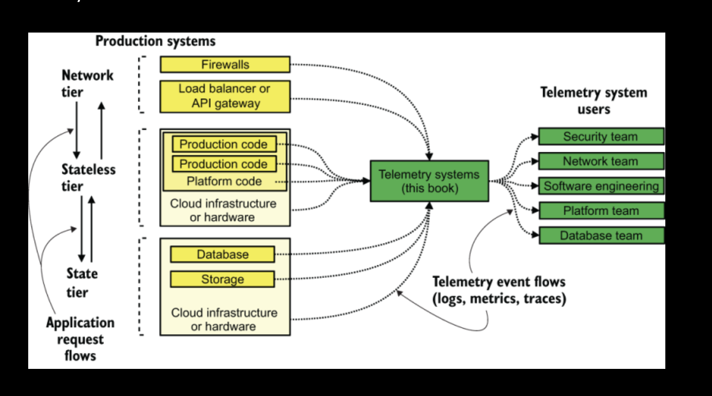

Telemetry is the feedback we get from production systems that tells you whats going on there.

## Telemetry and Tech Infra

# 1. Major Telemetry styles in use today are:

1. **Centralized Logging** - This takes text-based logging output from production systems and centralizes it to ease searching.
2. **Metrics** - Focuses on numbers rather than text
3. **Distributed Tracing** - Focuses on tracking events across many components of a distributed system
4. **Security Information Event Management** - A specialized telemetry system to be used by Security and Compliance Teams, an specialization of centralized logging and metrics. (Who did what, when they did it, how they did it, etc)

## 1.1 Defining Styles of Telemetry

- Why did we move from Centralized Logging to collecting Metrics? Very high storage costs for Centralized Logging.

- TimeSeries Database are very efficient in storing info (Due to a concept called cardinality)
